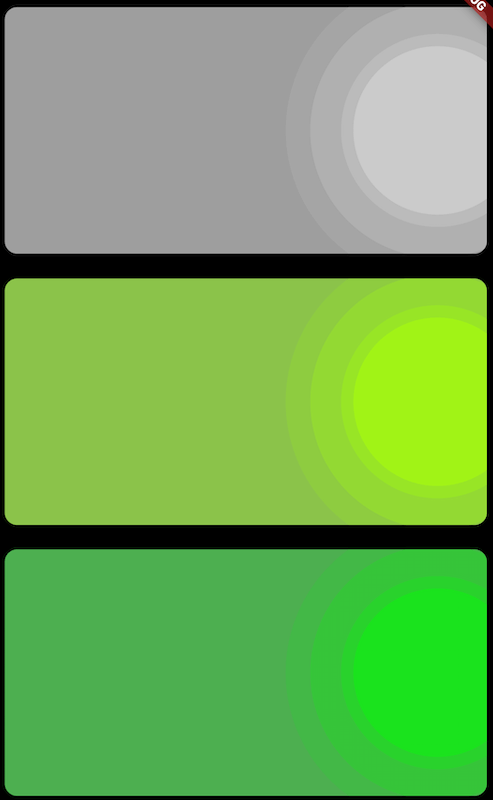

# flutter_playground

A Flutter playground application for practice.

|Widget|Demo|Note|
|:---:|:---:|:---:|
|WaveCard| |`CoustomPaint` `CoustomPainter` `Canvas` `BlendMode`|
|Dragger|| `StreamController` `GestureDetector`|
|PositionedTiles||`UniqueKey`|
|GlobalKeysReuseWidget|| https://github.com/flutter/flutter/issues/16630#issuecomment-498035360|
|IntervalProgressBar|  | https://github.com/stefanJi/IntervalProgressBar |